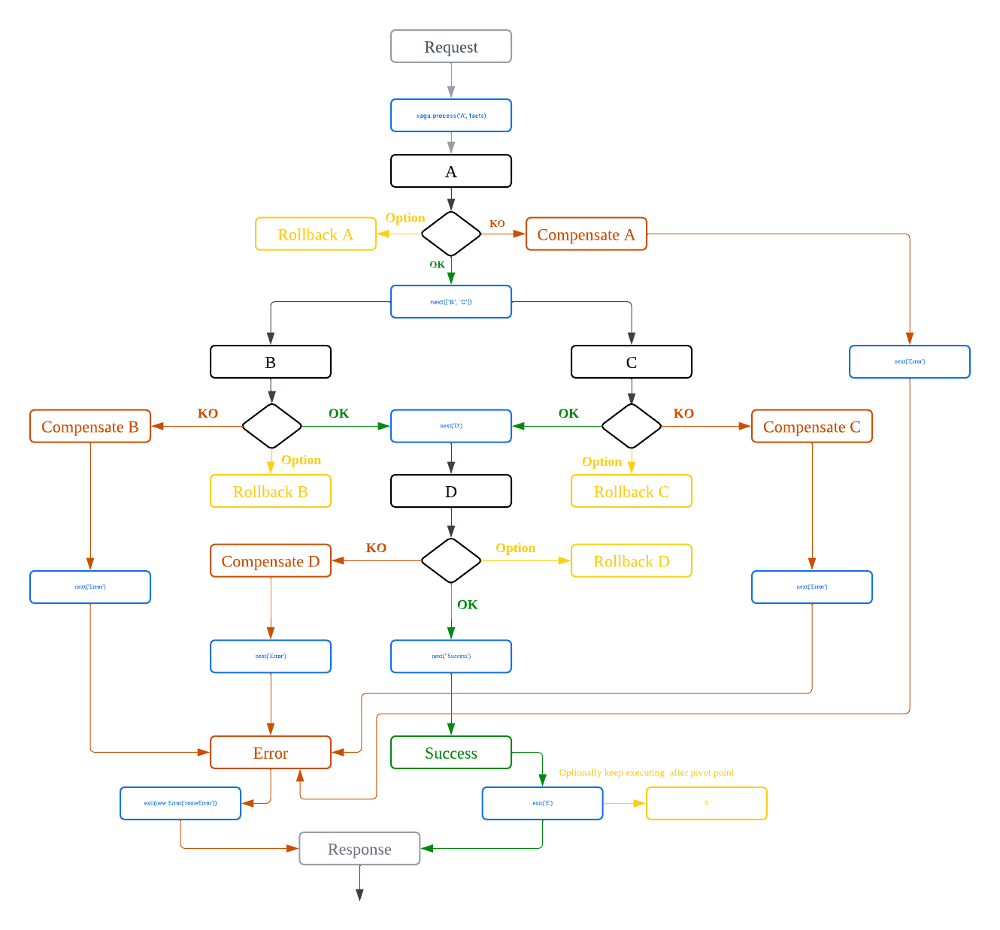

# Drumset

The `drumset` package provides a robust and user-friendly framework for managing complex workflows using the saga pattern.
This pattern is particularly useful for handling distributed transactions by defining a sequence of steps (nodes)
and the logic for compensating (undoing) steps when failures occur. By defining saga's nodes and their relationships,
you can ensure reliable and consistent transaction processing, even in the presence of failures.

```shell

npm i -s drumset

```

Creates a new instance of the `Saga` class.

```javascript
import { Saga } from 'drumset';

const saga = new Saga({
  verbose: true,
  logger: console,
});
```

### Saga instance methods:

#### `addNode(name, handler, meta, scaling): void`

Adds a node to the saga.

- **Parameters:**
  - `name` (string): The name of the node.
  - `handler` (function): An asynchronous function that performs the node's operation. The function receives the following arguments:
    - `facts` (object): The current state of the saga.
    - `next` (function): A function to call the next node.
    - `exit` (function): A function to complete the saga or terminate it with an error.
    - `retry` (function): A function to retry processing of the facts on the current node.
  - `meta` (object, optional): Additional processing options for the node.
    - `retriesLimit` (number): The maximum number of retries for the node.
    - `timeoutBetweenRetries` (number): The time in milliseconds to wait between retries.
    - `rollbackWhenErrorNode` (string): The name of the node to call for compensation if this node fails.
    - `rollbackWhenSuccessNode` (string): The name of the node to call for rollback if this node succeeded but something went wrong in the execution chain after.
    - `runAfterNodesSucceed` (string[]): An array of node names that must succeed before this node will start.
  - `scaling` (object, optional): Additional processing options for the node:
    - `minNodes`: The min count of concurrent nodes that use one queue.
    - `maxNodes`: The max count of concurrent nodes that use one queue. This determines how many instances of this node can run concurrently.
    - `queueSizeScalingThreshold`: threshold of the queue size to run the horizontal scaling

#### `addMiddleware(names, handlers): void`

- **Parameters:**
  - `names` (string): An array of names of the nodes to which middlewares should be applied.
  - `handler` (function): An array of the asynchronous functions, each function receives the following arguments:
    - `facts` (object): The current state of the saga.
    - `next` (function): A function to call the next node.
    - `exit` (function): A function to complete the saga or terminate it with an error.

#### `process(startNode, facts, factsMeta): Promise<facts>`

Starts the saga from the specified node.

- **Parameters:**
  - `startNode` (string, required): The name of the node to start the saga.
  - `facts` (object, required): The initial state of the saga.
  - `factsMeta` (object, optional): Initial meta specific for current facts
    - `executeAfter` (number): The timestamp in milliseconds after which fact processing should start.
    - `expireAfter` (number): The timestamp in milliseconds when facts should be expired and execution chain should be stopped.
    - `retriesLimit` (number): The maximum number of retries for the facts.
- **Returns:**
  - `Promise`: Resolves with the final state (the same contract you defined for the facts argument) of the saga or rejects with an error.

### Example Usage:

```javascript
const { Saga } = require('drumset');

const calls = [];

const facts = {
  balance: 9,
  amount: 10,
  to: 'a',
  from: 'b',
};

const saga = new Saga();

saga.addNode(
  'A',
  async (facts, next, exit, retry) => {
    console.log(`A executed`);
    calls.push('A');
    next([
      'B',
      'C',
    ]);
  },
  {
    retriesLimit: 1,
    rollbackWhenErrorNode: 'CompensateA',
    rollbackWhenSuccessNode: 'RollbackA',
  },
  {
    minNodes: 1,
    maxNodes: 2,
    queueSizeScalingThreshold: 10,
  },
);

saga.addNode(
  'CompensateA',
  async (facts, next, exit, retry) => {
    console.log(`CompensateA executed`);
    calls.push('CompensateA');
    next('Error');
  },
  {
    retriesLimit: 1,
  },
  {
    minNodes: 1,
    maxNodes: 2,
    queueSizeScalingThreshold: 5,
  },
);

saga.addNode(
  'RollbackA',
  async (facts, next, exit, retry) => {
    console.log(`RollbackA executed`);
    calls.push('RollbackA');
  },
  {
    retriesLimit: 1,
  },
  {
    minNodes: 1,
    maxNodes: 2,
    queueSizeScalingThreshold: 5,
  },
);

saga.addNode(
  'B',
  async (facts, next, exit, retry) => {
    await new Promise((resolve) => setTimeout(resolve, Math.round(Math.random() * 1000)));
    console.log(`B executed`);
    calls.push('B');
    // throw new Error('WTF something went wrong');
    next('D');
  },
  {
    retriesLimit: 2,
    rollbackWhenErrorNode: 'CompensateB',
    rollbackWhenSuccessNode: 'RollbackB',
  },
  {
    minNodes: 1,
    maxNodes: 2,
    queueSizeScalingThreshold: 5,
  },
);

saga.addNode(
  'CompensateB',
  async (facts, next, exit, retry) => {
    console.log(`CompensateB executed`);
    calls.push('CompensateB');
    next('Error');
  },
  {
    retriesLimit: 1,
  },
  {
    minNodes: 1,
    maxNodes: 2,
    queueSizeScalingThreshold: 5,
  },
);

saga.addNode(
  'RollbackB',
  async (facts, next, exit, retry) => {
    console.log(`RollbackBexecuted`);
    calls.push('RollbackB');
  },
  {
    retriesLimit: 1,
  },
  {
    minNodes: 1,
    maxNodes: 2,
    queueSizeScalingThreshold: 5,
  },
);

saga.addNode(
  'C',
  async (facts, next, exit, retry) => {
    console.log(`C executed`);
    // Move an error throwing to another node to check result
    throw new Error('stop');
    calls.push('C');
    next('D');
  },
  {
    retriesLimit: 1,
    rollbackWhenErrorNode: 'CompensateC',
    rollbackWhenSuccessNode: 'RollbackC',
  },
  {
    minNodes: 1,
    maxNodes: 2,
    queueSizeScalingThreshold: 5,
  },
);
saga.addNode(
  'D',
  async (facts, next, exit, retry) => {
    console.log(`D executed`);
    calls.push('D');
    next('Success');
  },
  {
    retriesLimit: 1,
    rollbackWhenErrorNode: 'CompensateD',
    rollbackWhenSuccessNode: 'RollbackD',
    runAfterNodesSucceed: [
      'B',
      'C',
    ],
  },
  {
    minNodes: 2,
    maxNodes: 4,
    queueSizeScalingThreshold: 5,
  },
);

saga.addNode(
  'CompensateC',
  async (facts, next, exit, retry) => {
    console.log(`CompensateC executed`);
    calls.push('CompensateC');
    next('Error');
  },
  {
    retriesLimit: 3,
  },
  {
    minNodes: 1,
    maxNodes: 2,
    queueSizeScalingThreshold: 5,
  },
);

saga.addNode(
  'CompensateD',
  async (facts, next, exit, retry) => {
    console.log(`CompensateD executed`);
    calls.push('CompensateD');
    next('Error');
  },
  {
    retriesLimit: 3,
  },
  {
    minNodes: 1,
    maxNodes: 2,
    queueSizeScalingThreshold: 5,
  },
);

saga.addNode(
  'RollbackC',
  async (facts, next, exit, retry) => {
    await new Promise((resolve) => setTimeout(resolve, Math.round(Math.random() * 2000)));
    console.log(`RollbackC executed`);
    calls.push('RollbackC');
  },
  {
    retriesLimit: 1,
  },
  {
    minNodes: 1,
    maxNodes: 2,
    queueSizeScalingThreshold: 5,
  },
);

saga.addNode(
  'RollbackD',
  async (facts, next, exit, retry) => {
    await new Promise((resolve) => setTimeout(resolve, Math.round(Math.random() * 2000)));
    console.log(`RollbackD executed`);
    calls.push('RollbackD');
  },
  {
    retriesLimit: 1,
  },
  {
    minNodes: 1,
    maxNodes: 2,
    queueSizeScalingThreshold: 5,
  },
);

saga.addNode(
  'Error',
  async (facts, next, exit, retry) => {
    console.log(`Error executed`);
    calls.push('Error');
    exit(new Error('WTF'));
  },
  {
    retriesLimit: 2,
    timeoutBetweenRetries: 1000,
  },
  {
    minNodes: 1,
    maxNodes: 5,
    queueSizeScalingThreshold: 10,
  },
);

saga.addNode(
  'Success',
  async (facts, next, exit) => {
    console.log(`Success executed`);
    calls.push('Success');
    exit();
  },
  { retriesLimit: 1 },
  {
    minNodes: 1,
    maxNodes: 2,
    queueSizeScalingThreshold: 5,
  },
);

setTimeout(() => {
  // Take a look behind the scenes to check all running nodes
  console.log(calls);
}, 10000);

saga
  .process('A', facts)
  .then((result) => {
    console.log({ result });
  })
  .catch((error) => console.log({ error }))
  .finally(() => {
    // Take a look what nodes were running when you receive reply
    console.log(calls);
  });
```

### Middlewares

```typescript
saga.addMiddleware(
  [
    'A',
    'D',
  ],
  [
    async (facts) => {
      console.log(`Middleware executed`);
    },
  ],
);
```

### Node Definitions

Here we have the next nodes:

- A: our saga`s entry point
- RollbackA: rollbacks succeeded A if something went wrong in the execution chain after that
- CompensateA: rollbacks failed A and goes to the Error node
- B: is executing simultaneously with node C
- C: is executing simultaneously with node B
- RollbackB: the same as RollbackA but for the node B
- CompensateB: the same as CompensateA but for the node B
- RollbackC: ...
- CompensateC: ...
- D: run if B and C nodes both succeeded
- RollbackD: ...
- CompensateD: ...
- Error: prepare and returns error response
- Success: prepare and returns success response

### Our saga`s graph



#### [Sandbox](sandbox/example.js)

#### [Changelog](./CHANGELOG.md)
